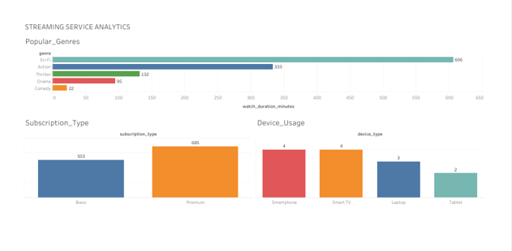

# Streaming Platform Analysis

Bu proje, bir yayın platformunun (streaming platform) kullanıcı davranışlarını, içerik trendlerini ve cihaz kullanım metriklerini inceleyen kapsamlı bir veri analizi çalışmasıdır. Analiz süreci ve modellemeler yaklaşık 6-7 ay önce tamamlanmış olup, bulgular derlenerek portföy amaçlı olarak şimdi yayına alınmıştır.

## 📊 Tableau Dashboard

Projenin interaktif versiyonuna ve özet paneline aşağıdan ulaşabilirsiniz:
👉 [**Tableau Dashboard'u Görüntülemek İçin Tıklayın**] https://prod-ch-a.online.tableau.com/t/batuhandenizli-82d38b3220/authoring/SectoronCampusProject-StreamingPlatformAnalysis/Platform_Usage_Overview#1

## 🛠️ Kullanılan Teknolojiler
*   **SQL:** Veritabanı şema tasarımı, veri birleştirme (JOIN) ve detaylı metrik sorguları.
*   **Tableau:** İleri seviye veri görselleştirme ve interaktif dashboard oluşturma.
*   **İstatistiksel Analiz:** Kullanıcı etkileşimleri ve içerik bazlı trend değerlendirmeleri.

## 📂 Dosya Yapısı
*   `Dataset/`: Analizde kullanılan veri setleri (Content, Devices, Ratings, Users, Watch_Events).
*   `Sector on Campus Project - Streaming Platform Analysis.twbx`: Orijinal Tableau çalışma dosyası.
*   `Schema And SQL Queries With Results + dashboard.docx`: Projenin veritabanı şeması ve SQL sorgu çıktıları.

## 👨‍💻 Geliştirici
**Batuhan Denizli**
*Eskişehir Teknik Üniversitesi, İstatistik*
